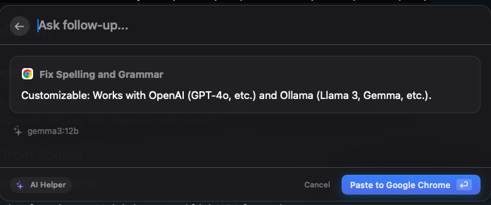

<p align="center">
  
</p>

# AIHelper

**AIHelper** is a sleek, lightweight macOS menu bar utility that brings powerful AI writing assistance to any application. Just select text, press a hotkey (⌘⇧G), and let AI fix your grammar, rephrase, or answer follow-up questions.



## Features

- **Global Hotkey:** Trigger the AI assistant instantly from any app (default: `⌘⇧G`).
- **AI Writing Assistance:** Fix spelling, grammar, and improve clarity.
- **Follow-up Chat:** Ask the AI questions about your selected text context.
- **Raycast-inspired UI:** A beautiful, non-intrusive popup that stays out of your way.
- **Paste Back:** Instantly paste the AI's response back into your source application.
- **Customizable:** Works with **OpenAI** (GPT-4o, etc.) and **Ollama** (Llama 3, Gemma, etc.).

## Installation

### Prerequisites

- macOS 13.0 or later.
- An OpenAI API key **OR** Ollama running locally.

### Build from Source

1. Clone the repository:
   ```bash
   git clone https://github.com/canhlinh/AIHelper.git
   cd AIHelper
   ```
2. Build and Install:
   ```bash
   make install
   ```

## Configuration

1. **Accessibility Permissions:** AIHelper requires Accessibility permissions to listen for the global hotkey and interact with other apps.
2. **AI Provider:** Click the menu bar icon (text bubble) → **Settings** to configure your OpenAI API Key or Ollama Base URL.
3. **Shortcut:** Change the global trigger shortcut in the Settings window.

## License

This project is licensed under the MIT License - see the [LICENSE](LICENSE) file for details.
